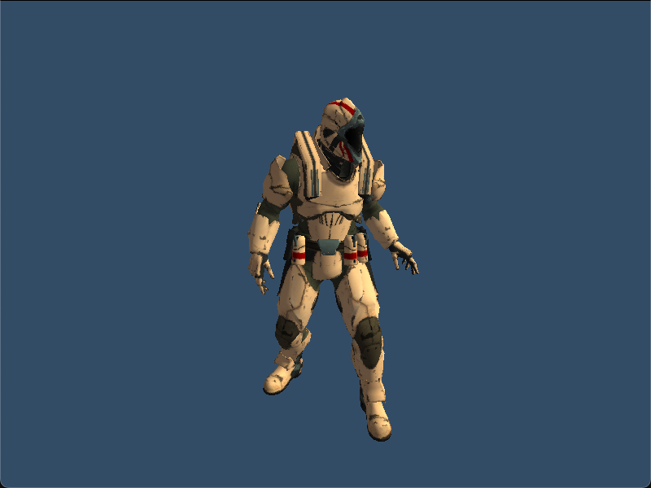

# 3D Skeletal Animation with C++, OpenGL

Import GLTF models with Assimp and animate them with ozz_animation.

The GLTF model is from [mixamo.com](https://www.mixamo.com/) and has been modified with Blender to include 5 animations: idle, crouch idle, walking, running and running with gun.

Press "SPACE" to cycle through the animations and "P" to toggle the play/pause of the animation.

This project uses CMake to install and configure dependencies:

- [GLFW](https://www.glfw.org/)
- [glad](https://glad.dav1d.de/)
- [glm](https://glm.g-truc.net/)
- [assimp](https://assimp.org/)
- [stb](https://github.com/nothings/stb)
- [ozz_animation](https://guillaumeblanc.github.io/ozz-animation/)
